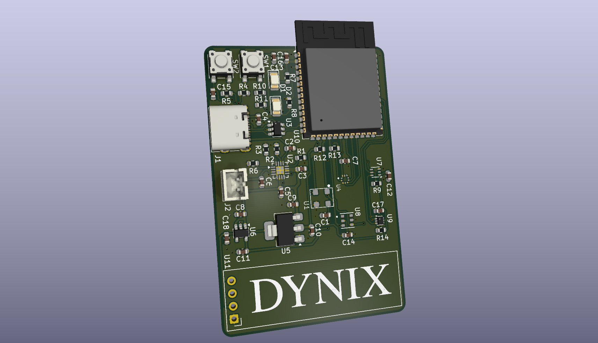
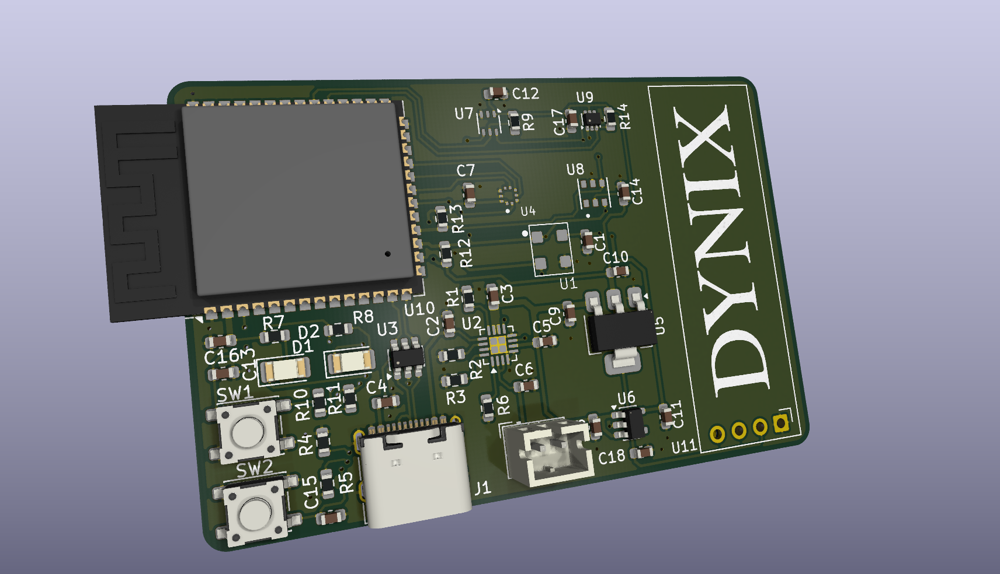
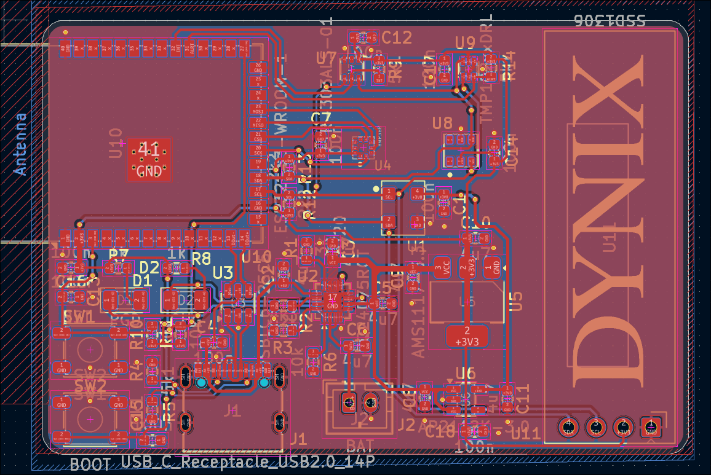
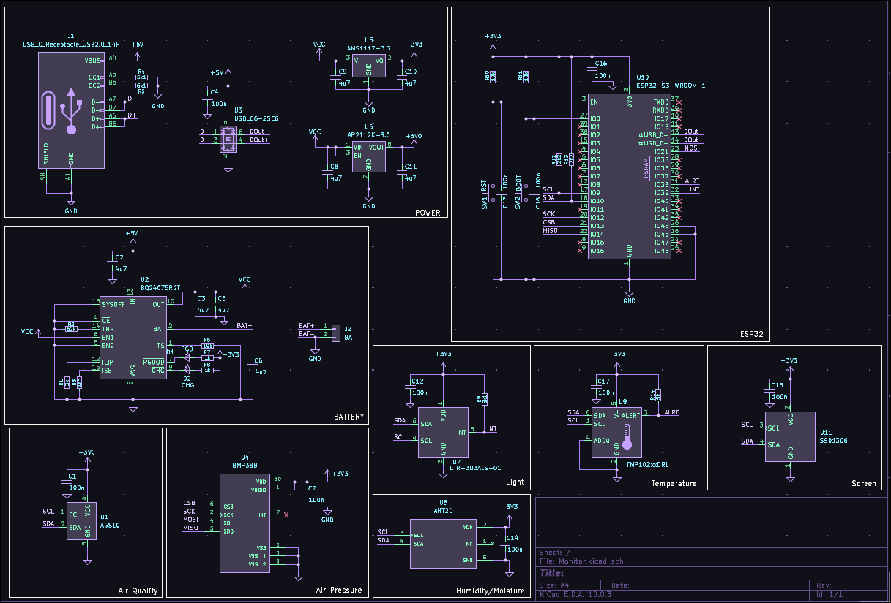

# Environment-Monitor
This is a board that serves as an environment sensor, recording the temperature, humidity, air pressure, brightness, and air quality of the area around it. It does this through the use of 5 sensors: TMP102AIDR, AHT20-F, BMP388, LTR303, and AGS10. The information can be displayed of the built in SSD1306 0.91 screen.
# Why I Made It
Not surprisingly I spend a lot of time sitting indoors in my room on my computer.  With this, I often have my door closed and sometimes the window open. I wanted a device that can monitor my room so I can make optimize my environment so if it detects that it's getting to hot (for example) I can open the window more or open my door. 

# Pictures

# BOM
|Name             |Purpose                           |Quantity|Total Cost (USD)|Link                                                                                                                                                            |Distributor|
|-----------------|----------------------------------|--------|----------------|----------------------------------------------------------------------------------------------------------------------------------------------------------------|-----------|
|3.7v Battery     |Power when not plugged in         |        |6.57            |https://www.aliexpress.us/item/3256811644617885.html                                                                                                            |Aliexpress |
|SSD1306 Display  |Displaying Measured Stats         |        |2.20            |https://www.aliexpress.us/item/3256808453793642.html                                                                                                            |Aliexpress |
|JST Connector    |Battery Connector                 |        |0.67            |https://www.lcsc.com/product-detail/C131337.html                                                                                                                |LCSC       |
|USB C Receptacle |Programming and Power             |        |0.41            |https://www.lcsc.com/product-detail/C2988369.html                                                                                                               |LCSC       |
|4.3k Resistor    |Configuration Resistor            |        |0.11            |https://www.lcsc.com/product-detail/C2930099.html                                                                                                               |LCSC       |
|62k Resistor     |Configuration Resistor            |        |0.11            |https://www.lcsc.com/product-detail/C2907059.html                                                                                                               |LCSC       |
|3k Resistor      |Configuration Resistor For BQ24075|        |0.12            |https://www.lcsc.com/product-detail/C2907033.html?spm=wm.gwc.xh.16.cbm___wm.sy.ssl.gwc&lcsc_vid=RwcIBQFURFlfBFxQFVkMX1dSRQULAgZfRVYKU1FXQQIxVlNRTlNaXlJSR1dXUDtW|LCSC       |
|2.2k Resistor    |I2C Pullups                       |        |0.10            |https://www.lcsc.com/product-detail/C2907117.html                                                                                                               |LCSC       |
|1k Resistor      |For LEDs                          |        |0.10            |https://www.lcsc.com/product-detail/C2907002.html                                                                                                               |LCSC       |
|10k Resistor     |Pull Ups                          |        |0.10            |https://www.lcsc.com/product-detail/C2930027.html?spm=wm.gwc.xh.13.cbm___wm.sy.ssl.gwc&lcsc_vid=RwcIBQFURFlfBFxQFVkMX1dSRQULAgZfRVYKU1FXQQIxVlNRTlNaXlJSR1dXUDtW|LCSC       |
|5.1k Resistor    |For USB CC1 and CC2               |        |0.10            |https://www.lcsc.com/product-detail/C2907114.html?spm=wm.gwc.xh.12.cbm___wm.sy.ssl.gwc&lcsc_vid=RwcIBQFURFlfBFxQFVkMX1dSRQULAgZfRVYKU1FXQQIxVlNRTlNaXlJSR1dXUDtW|LCSC       |
|4.7uF Capacitor  |Decoupling Capacitor              |        |0.30            |https://www.lcsc.com/product-detail/C8032.html                                                                                                                  |LCSC       |
|100nF Resistor   |Decoupling                        |        |0.25            |https://www.lcsc.com/product-detail/C5137636.html                                                                                                               |LCSC       |
|USBLC6-2SC6      |Protection for USB                |        |0.16            |https://www.lcsc.com/product-detail/C5261088.html                                                                                                               |LCSC       |
|BQ24075RGTR      |Power Path and Battery Charging   |        |1.05            |https://www.lcsc.com/product-detail/C15464.html                                                                                                                 |LCSC       |
|TPAP2112K-3.0TRG1|Power Regulator for AGS10         |        |0.35            |https://www.lcsc.com/product-detail/C23380903.html                                                                                                              |LCSC       |
|AMS1117-3.3      |Power Regulator                   |        |0.42            |https://www.lcsc.com/product-detail/C347222.html                                                                                                                |LCSC       |
|LTR-303ALS-01    |Light Sensor                      |        |0.41            |https://www.lcsc.com/product-detail/C364577.html                                                                                                                |LCSC       |
|AGS10            |TVOC/Air Quality Sensor           |        |1.59            |https://www.lcsc.com/product-detail/C3012632.html                                                                                                               |LCSC       |
|BMP388           |Air Pressure Sensor               |        |2.81            |https://www.lcsc.com/product-detail/C779278.html                                                                                                                |LCSC       |
|TMP102AIDRLR     |Accurate Temperature Sensor       |        |1.27            |https://www.lcsc.com/product-detail/C99269.html                                                                                                                 |LCSC       |
|AHT20-F          |Humidity Sensor                   |1       |0.76            |https://www.lcsc.com/product-detail/C3012622.html                                                                                                               |LCSC       |
|ESP32-S3         |Microcontroller for board         |1       |5.25            |https://www.lcsc.com/product-detail/C2913205.html                                                                                                               |LCSC       |
|Stencil          |Help With Soldering               |        |7.11            |                                                                                                                                                                |JLCPCB     |
|PCB              |Place Components On               |        |5.11            |                                                                                                                                                                |JLCPCB     |
